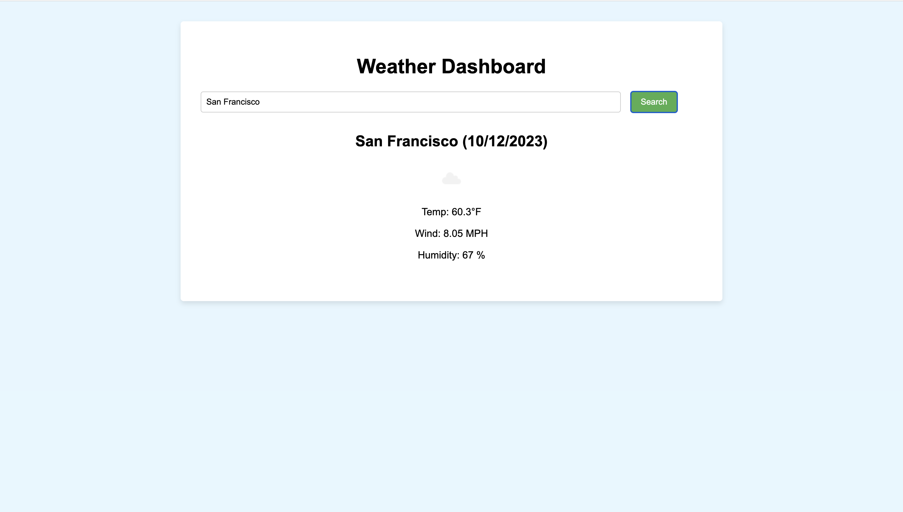

# Weather Dashboard 🌤️

A responsive and user-friendly weather dashboard that allows users to search for current weather conditions and a 5-day forecast for cities around the world.

## Features

- **Search Bar**: Easily search for any city to get current weather conditions.
- **Search History**: Recently searched cities are saved and can be clicked on for quick access.
- **5-Day Forecast**: View a 5-day forecast to plan ahead.
- **Responsive Design**: Works on both desktop and mobile devices.

## Installation and Setup

1. Clone the repository:
2. Navigate to the project directory:
3. Open `index.html` in your favorite browser.

## Usage

1. Enter the name of the city in the search bar and click the "Search" button.
2. View the current weather conditions for the city.
3. Scroll down to see the 5-day forecast.
4. Click on a city from the search history to quickly view its weather again.

## Technologies Used

- HTML
- CSS
- JavaScript

## Contribution

Pull requests are welcome. For major changes, please open an issue first to discuss what you would like to change.
